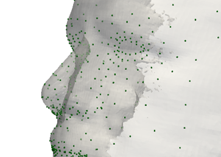

# Custom Respiratory Masks – AI & 3D Automation

## 📌 Overview

This project provides a fully automated pipeline for creating personalized respiratory masks tailored to individual face morphology, specifically addressing comfort issues in sleep apnea therapy.

This project was developed in collaboration with **Dr. David Amar**, pulmonologist at Hôpital Privé Paul d'Égine (Champigny-sur-Marne), ensuring medical relevance and real-world applicability.

### 🩺 Context & Market Opportunity

Sleep apnea affects a large adult population, with approximately **56%** reporting discomfort using standard respiratory masks. This initiative seeks to enhance patient comfort and adherence by providing fully customized masks.

## 🚀 Detailed Solution: End-to-End Automated Process

The system enables users to generate a mask fitted to their unique facial structure in a few simple steps:

1. **📱 Face Scanning**:

   - A 3D scan of the user’s face is captured using a smartphone with photogrammetry apps (e.g. Luma AI).
   - The scan accurately records the nose and mouth area, enabling nasal, mouth, or full-face mask designs.

2. **🤖 AI-Powered Shape Adaptation**:

   - Facial landmarks are automatically detected using Google’s **MediaPipe** framework.
   - A custom mask shape is generated and adapted to the user’s scan with optimized sealing zones.

3. **🔧 STL Export & Compatibility**:

   - The generated design is converted into a 3D-printable STL file.
   - It is directly compatible with standard respiratory interfaces (CPAP/BiPAP machines).

4. **🖨️ 3D Printing & Fulfillment**:

   - The STL can be printed at home or ordered online via drop-shipping services.
   - Designs are optimized for flexible materials and standard FDM printers.

This process is fully automated: from scan input to printable file, no manual editing is required.

## ⚙️ Technical Stack (Geek-Level Details)

- **Languages & Libraries**:

  - Python 3.10
  - [MediaPipe](https://google.github.io/mediapipe/) for real-time 3D facial landmark detection.
  - [VTK](https://vtk.org/) for 3D mesh processing, smoothing, segmentation, and STL export.
  - NumPy, SciPy for numerical computation.

- **Geometry Processing**:

  - Surface smoothing and region cleanup using VTK filters.
  - Custom geometric analysis for identifying nose contours, mouth regions, and fit surfaces.
  - STL mesh generation with print-ready topology and validated sealing zones.

- **Automation & Workflow**:

  - Modular Python scripts organized by processing stage (scan loading, landmark extraction, mesh fitting, STL export).
  - Internal config flags (not command-line based) for mask type selection and export behavior.
  - STL validation and basic mesh visualization for quality control.

- **3D Printing Readiness**:

  - STL files tuned for TPU filament, optimized for slicing with Cura or PrusaSlicer.
  - Ready for home printing or integration with external print services (e.g., Printful-style dropshipping).

## 🎯 Key Benefits

- **Enhanced Comfort**: Custom precision fit tailored to individual facial structures.
- **Rapid Prototyping**: Significantly faster production cycle from scan to product.
- **High Scalability**: Fully automated workflow adaptable to industrial-scale production.
- **Cost-Effective**: Streamlined dropshipping integration reduces overhead and inventory needs.

## 📸 Visual Documentation

### 📱 Face Scan Input

### 🤖 Morphology Processing with Python

### 🎥 STL Preview 
[▶ Watch the STL model](./assets/3D_STL_Nose_Marsk.mp4)

### 🖨️ Printed Prototypes – Nasal and Full-face

### 🔌 Standard Equipment Compatibility

## 📈 Roadmap

- **Current Stage**: Functional prototypes validated.
- **Upcoming Steps**:
  - Clinical trials for comfort and effectiveness evaluation.
  - Industrial scaling, legal compliance, and IP strategy.
  - Finalize strategic partnerships and market launch preparation.

## 🌍 Expansion Potential

- **Medical Device Applications**: Potential for expansion into custom prosthetics, orthotics, and protective facial gear.
- **Predictive Analytics & Data**: Utilization of anonymized user data to refine AI-driven predictive fitting.
- **Global Market Growth**: Initial European expansion with long-term international market penetration.

## 🤝 Collaborate with Us

We welcome partnerships in R&D, clinical validation, production scaling, and market deployment.

## 🙏 Acknowledgements

Special thanks to **Dr. David Amar** for his invaluable clinical insights and support throughout the development of this project.

## 📬 Get in Touch

Connect through [GitHub](https://github.com/lionelgarnier) or [LinkedIn](https://www.linkedin.com/in/lionel-garnier) for collaboration opportunities or further project information.